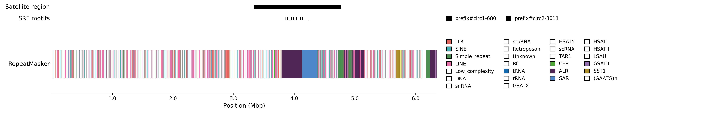

# Snakemake-srf

Workflow to run [`srf`](https://github.com/lh3/srf) and determine general satellite region(s).


> HG008-T chr21 centromere (haplotype2-0000038, reverse complement)

## Why?
* `dna-brnn` doesn't annotate HSAT-1A
* `RepeatMasker` is too slow

## Getting Started
```sh
# Ensure have snakemake>=8.0
git clone https://github.com/koisland/Snakemake-srf.git
cd Snakemake-srf
```

## Usage
```bash
snakemake -np --configfile config.yaml -c 16 --sdm conda
```

Configuration handled via `config.yaml`:
```yaml
# General parameters
threads: 16
mem: "20GB"
output_dir: "results"
log_dir: "logs"
benchmark_dir: "benchmarks"
samples:
  test_1: 
    # Directory of fasta files (No multifasta)
    input_dir: "test"
    # # Or list of fasta files. (No multifasta)
    # input_files: []
    parameters: 
      # Config for kmer counting with KMC
      kmer_size: 151
      exclude_kmers_lt_n: 3
      # Config for minimap2 align SRF motifs to fasta
      mm2_max_secondary_alns: 1000000
      mm2_ignore_minimizers_n: 1000
      mm2_aln_bandwidth: "100,100"
```

## Output
|file|desc|
|-|-|
|`{output_dir}/{sample}/{fname}/srf.bed`|SRF motif bedfile.|
|`{output_dir}/{sample}/{fname}/monomers.tsv`|TRF monomers.|
|`{output_dir}/{sample}/srf.bed`|SRF motif bedfile for all fnames.|
|`{output_dir}/{sample}/monomers.tsv`|TRF monomers for all fnames.|

## Test
On [HG008-T](https://www.nist.gov/programs-projects/cancer-genome-bottle) (Tumor) chr21 centromere.
```sh
snakemake -np --configfile test/config.yaml -c 16 --sdm conda
```

To generate README plot with [`cenplot`](https://github.com/logsdon-lab/CenPlot):
```sh
snakemake -p --configfile test/config.yaml -c 16 --sdm conda
cenplot draw -t test/cenplot_repeatmasker_plot.toml -c haplotype2-0000038
```

## Sources
* https://arxiv.org/abs/2304.09729
